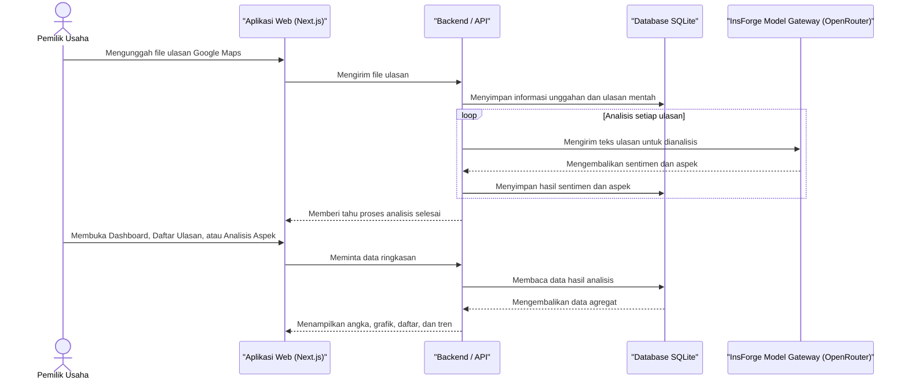
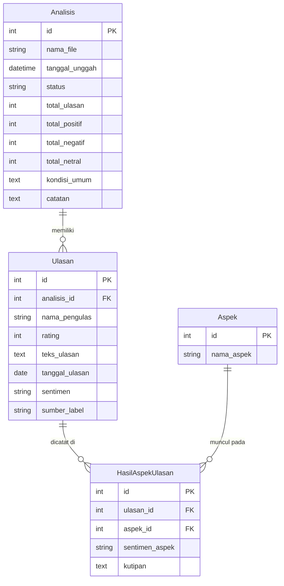

# PRD — Project Requirements Document

## 1. Overview

Aplikasi ini membantu pemilik usaha dan manajemen instansi mengubah ulasan Google Maps yang selama ini hanya menjadi angka dan komentar mentah menjadi informasi yang benar-benar berguna untuk perbaikan kualitas layanan.

Masalah utama yang diselesaikan adalah: banyak bisnis tahu bahwa mereka punya rating atau banyak komentar, tetapi tidak tahu secara terstruktur **berapa banyak ulasan yang positif, negatif, atau netral**, serta **aspek layanan mana yang harus diperbaiki dan mana yang harus dipertahankan**.

Tujuan aplikasi:
- Memberikan ringkasan sentimen yang rapi dan terstruktur dari seluruh ulasan yang diunggah.
- Menampilkan jumlah dan proporsi ulasan positif, negatif, dan netral.
- Menunjukkan aspek pelayanan yang perlu diperbaiki, misalnya kebersihan atau harga, dan aspek yang perlu dipertahankan.
- Membantu pengguna memantau apakah layanan semakin membaik atau memburuk dari waktu ke waktu.

## 2. Requirements

1. Pengguna dapat mengunggah file berisi ulasan Google Maps, misalnya file CSV atau Excel.
2. Aplikasi dapat membaca dan memproses data ulasan dari file tersebut.
3. Sistem mengelompokkan setiap ulasan ke dalam sentimen: positif, negatif, atau netral.
4. Dashboard menampilkan jumlah total, proporsi sentimen, dan ringkasan kondisi umum layanan.
5. Pengguna dapat melihat daftar ulasan lengkap dan menyaringnya berdasarkan sentimen atau kata kunci.
6. Sistem dapat mengenali aspek-aspek layanan seperti pelayanan, kebersihan, harga, fasilitas, dan lain-lain.
7. Sistem menunjukkan aspek yang paling banyak dikeluhkan dan aspek yang paling banyak dipuji.
8. Hasil analisis tersimpan sehingga dapat dibandingkan antar periode untuk melihat tren.
9. Tampilan aplikasi harus mudah dipahami oleh pemilik usaha atau manajemen yang tidak terlalu teknis.
10. Data ulasan yang diunggah hanya digunakan untuk keperluan analisis pengguna dan tidak ditampilkan kepada publik.

## 3. Core Features

### Fase 1 — Dashboard Sentimen

Fitur utama pada fase ini adalah **Dashboard Sentimen**, yaitu layar pertama yang menampilkan hasil analisis seluruh ulasan dalam bentuk angka dan grafik.

- **Rekap Jumlah** — Menampilkan total ulasan positif, negatif, dan netral dari data yang diunggah. Jumlah ini menjadi ringkasan utama yang paling cepat dipahami pengguna.
- **Proporsi Sentimen** — Menampilkan diagram sebaran sentimen, misalnya donat atau pie chart, agar pengguna langsung melihat porsi masing-masing kategori sentimen.
- **Kondisi Umum** — Memberikan kalimat ringkas yang menjelaskan kondisi layanan saat ini, misalnya “Mayoritas pengunjung puas dengan pelayanan, tetapi banyak yang mengeluhkan kebersihan area parkir.”

### Fase 2 — Unggah Data, Daftar Ulasan, dan Analisis Aspek

Fitur pertama: **Unggah Data**

- **Pilih Berkas** — Pengguna mengambil file ulasan Google Maps dari perangkatnya. Aplikasi menerima file berformat CSV atau Excel.
- **Pratinjau Data** — Sebelum diproses, aplikasi menampilkan sebagian isi file agar pengguna yakin bahwa kolom dan data yang dipilih sudah benar.
- **Mulai Analisis** — Pengguna menjalankan proses analisis. Aplikasi memproses setiap ulasan, lalu memberi tahu pengguna saat hasilnya selesai dibuat.

Fitur kedua: **Daftar Ulasan**

- **Saring Sentimen** — Menampilkan ulasan tertentu saja, misalnya hanya ulasan negatif atau hanya ulasan positif.
- **Cari Ulasan** — Pengguna bisa mencari ulasan berdasarkan kata kunci tertentu, misalnya “lambat” atau “ramah”.
- **Detail Ulasan** — Setiap ulasan bisa dibuka untuk melihat isi lengkap beserta kategori sentimennya.

Fitur ketiga: **Analisis Aspek**

- **Aspek Perlu Diperbaiki** — Menampilkan aspek seperti pelayanan, kebersihan, harga, atau fasilitas yang paling sering dikeluhkan pengunjung. Semakin banyak keluhan pada satu aspek, semakin besar prioritasnya untuk diperbaiki.
- **Aspek Perlu Dipertahankan** — Menampilkan aspek yang paling sering dipuji pengunjung sehingga perlu tetap dijaga.
- **Nilai Setiap Aspek** — Memberikan ringkasan sentimen untuk setiap aspek, misalnya berapa banyak ulasan positif dan negatif yang menyebut aspek tersebut, agar mudah dibandingkan satu sama lain.

### Fase 3 — Pemantauan Tren

Fitur utama: **Pemantauan Tren**

- **Riwayat Analisis** — Menyimpan dan menampilkan seluruh hasil analisis dari periode sebelumnya, lengkap dengan tanggal unggah dan nama filenya.
- **Perbandingan Periode** — Membandingkan hasil analisis dua periode, misalnya bulan ini dibandingkan bulan lalu, dan menunjukkan selisih jumlah sentimen.
- **Grafik Tren** — Menampilkan arah perubahan sentimen dalam bentuk grafik garis atau batang, sehingga pengguna bisa melihat apakah layanan semakin baik atau semakin buruk.

## 4. User Flow

### Alur awal ketika pertama kali menggunakan aplikasi

1. Pengguna membuka aplikasi dan melihat Dashboard Sentimen yang masih kosong. Aplikasi menampilkan ajakan untuk mengunggah data.
2. Pengguna memilih menu **Unggah Data**.
3. Pengguna memilih file ulasan Google Maps dari perangkat (CSV atau Excel).
4. Aplikasi menampilkan **Pratinjau Data** agar pengguna dapat memeriksa kembali isi file.
5. Pengguna menekan tombol **Mulai Analisis**.
6. Aplikasi memproses data. Proses berjalan di server sehingga pengguna tidak perlu menunggu di halaman yang sama.
7. Setelah selesai, pengguna diarahkan ke **Dashboard Sentimen** yang menampilkan:
   - jumlah ulasan positif, negatif, dan netral;
   - proporsi sentimen dalam bentuk grafik;
   - kalimat kondisi umum layanan.
8. Pengguna membuka **Daftar Ulasan** untuk melihat detail ulasan, memfilter berdasarkan sentimen, atau mencari kata kunci.
9. Pengguna membuka halaman **Analisis Aspek** untuk melihat aspek mana yang perlu diperbaiki dan aspek mana yang perlu dipertahankan.

### Alur untuk pemantauan berkala

10. Pada periode berikutnya, pengguna mengunggah file ulasan terbaru dengan cara yang sama.
11. Setelah hasil periode terbaru selesai, pengguna membuka **Pemantauan Tren**.
12. Pengguna memilih dua periode yang ingin dibandingkan, misalnya periode bulan lalu dan bulan ini.
13. Aplikasi menampilkan selisih jumlah sentimen dan grafik tren dari waktu ke waktu.
14. Pengguna bisa memutuskan apakah perlu ada perbaikan layanan atau mempertahankan aspek yang sudah dinilai baik.

## 5. Architecture

Aplikasi ini menggunakan pendekatan *full-stack*: satu aplikasi web menangani tampilan sekaligus logika backend. Pengguna berinteraksi melalui browser, data tersimpan di database, dan proses analisis sentimen dilakukan oleh layanan AI yang dipanggil dari backend.

Berikut diagram alur arsitektur proses analisis:

Penjelasan singkat arsitektur:

- **Aplikasi Web** berfungsi sebagai antarmuka pengguna. Halaman yang ditampilkan meliputi Dashboard, Unggah Data, Daftar Ulasan, Analisis Aspek, dan Pemantauan Tren.
- **Backend / API** menerima file unggahan, memvalidasi isi file, menyimpan data ke database, dan menjalankan proses analisis.
- **Database** menyimpan seluruh hasil analisis agar bisa dibuka kembali dan dibandingkan antar periode.
- **AI Gateway** digunakan untuk membaca isi ulasan dan menentukan sentimen serta aspek yang disebutkan dalam ulasan. Dengan cara ini, analisis lebih akurat dibandingkan hanya mengandalkan kata kunci sederhana.
- Proses analisis dilakukan secara bertahap di server agar file besar tidak membuat aplikasi lemot. Status analisis dapat ditampilkan agar pengguna tahu sedang dalam proses atau sudah selesai.

## 6. Database Schema

Aplikasi ini membutuhkan empat tabel utama:

1. `Analisis` — menyimpan setiap file data yang pernah diunggah dan dianalisis.
2. `Ulasan` — menyimpan detail setiap ulasan dari file yang diunggah.
3. `Aspek` — menyimpan daftar aspek layanan yang ditemukan dari ulasan.
4. `HasilAspekUlasan` — menghubungkan ulasan dengan aspek tertentu beserta sentimennya.

Berikut diagram hubungan antar tabel:

Penjelasan kolom utama:

### Tabel `Analisis`
Satu baris pada tabel ini mewakili satu kali unggahan data dan satu periode analisis.

- `id` (angka) — Kunci utama yang membedakan setiap analisis.
- `nama_file` (teks) — Nama file asli yang diunggah, agar mudah dikenali di Riwayat Analisis.
- `tanggal_unggah` (tanggal & waktu) — Waktu pengguna mengunggah data.
- `status` (teks) — Menandakan apakah analisis sedang berjalan, selesai, atau gagal.
- `total_ulasan` (angka) — Jumlah seluruh ulasan pada file tersebut.
- `total_positif`, `total_negatif`, `total_netral` (angka) — Ringkasan jumlah sentimen agar dashboard dapat ditampilkan dengan cepat.
- `kondisi_umum` (teks) — Kalimat ringkasan kondisi layanan yang dihasilkan setelah analisis selesai.
- `catatan` (teks) — Catatan proses analisis, misalnya jumlah ulasan yang gagal dianalisis beserta alasan kegagalannya.

### Tabel `Ulasan`
Satu baris pada tabel ini mewakili satu ulasan Google Maps.

- `id` (angka) — Kunci utama ulasan.
- `analisis_id` (angka, asing) — Menghubungkan ulasan ke analisis atau periode saat ulasan diunggah.
- `nama_pengulas` (teks) — Nama orang yang menulis ulasan.
- `rating` (angka) — Bintang ulasan dari Google Maps, biasanya 1 sampai 5.
- `teks_ulasan` (teks) — Isi lengkap ulasan.
- `tanggal_ulasan` (tanggal) — Tanggal ulasan ditulis, jika tersedia di file.
- `sentimen` (teks) — Hasil analisis: positif, negatif, atau netral. Bernilai kosong bila ulasan belum diproses atau gagal dianalisis.
- `sumber_label` (teks) — Asal label sentimen: `ai` (dihasilkan model lewat AI Gateway) atau `rating` (fallback berbasis rating bintang karena AI gagal setelah percobaan ulang).

### Tabel `Aspek`
Satu baris pada tabel ini mewakili satu aspek layanan.

- `id` (angka) — Kunci utama aspek.
- `nama_aspek` (teks) — Nama aspek yang ditemukan, misalnya “pelayanan”, “kebersihan”, “harga”, atau “fasilitas”.

### Tabel `HasilAspekUlasan`
Tabel penghubung yang mencatat aspek apa saja yang muncul di setiap ulasan dan apakah ulasan tersebut membicarakan aspek itu secara positif atau negatif.

- `id` (angka) — Kunci utama.
- `ulasan_id` (angka, asing) — Ulasan yang mengandung aspek tersebut.
- `aspek_id` (angka, asing) — Aspek yang ditemukan dalam ulasan.
- `sentimen_aspek` (teks) — Sentimen pada aspek tertentu, misalnya positif atau negatif.
- `kutipan` (teks) — Potongan kalimat dari ulasan yang menjadi alasan aspek tersebut dikategorikan, agar mudah ditampilkan kembali kepada pengguna.

Dari tabel `HasilAspekUlasan`, aplikasi dapat menghitung aspek mana yang paling sering dikeluhkan dan aspek mana yang paling sering dipuji.

Catatan proses pelabelan: setiap ulasan dikirim ke AI Gateway untuk ditentukan sentimen dan aspeknya. Bila pemanggilan gagal (timeout, error jaringan, 5xx, atau rate-limit 429), dilakukan percobaan ulang maksimal tiga kali dengan jeda bertahap. Bila AI tetap gagal, label sentimen diambil dari rating bintang sebagai fallback (`sumber_label = "rating"`). Ulasan yang tetap gagal setelah fallback tidak diberi sentimen dan dicatat pada `Analisis.catatan`; ulasan tersebut tetap dihitung dalam `total_ulasan` tetapi tidak masuk proporsi sentimen.

## 7. Tech Stack

- **Frontend:** Next.js, React, Tailwind CSS, dan shadcn/ui
- **Backend / API:** Next.js API Routes dan Better Auth untuk fondasi autentikasi pengguna
- **Database:** SQLite untuk penyimpanan data lokal yang sederhana dan ringan
- **ORM:** Drizzle ORM untuk mengelola dan membaca database dengan aman
- **Pengelolaan File Unggahan:** library parsing CSV dan Excel agar data Google Maps dapat dibaca
- **Deployment:** platform yang mendukung aplikasi Next.js, misalnya Vercel atau VPS sederhana
- **AI Provider / Gateway:** InsForge Model Gateway (OpenRouter)

Layanan AI pada aplikasi ini dipakai untuk dua hal utama:

1. Menentukan sentimen sebuah ulasan: positif, negatif, atau netral.
2. Mengenali aspek layanan yang disebutkan dalam ulasan beserta sentimennya, misalnya “pelayanan” atau “kebersihan”.

Setiap hasil AI dikembalikan dalam format terstruktur agar mudah disimpan ke database dan ditampilkan di dashboard. Dengan pemisahan ini, aplikasi tetap cepat karena tugas berat pemrosesan bahasa dilakukan di luar aplikasi utama, sedangkan aplikasi hanya menyimpan dan menampilkan hasilnya.